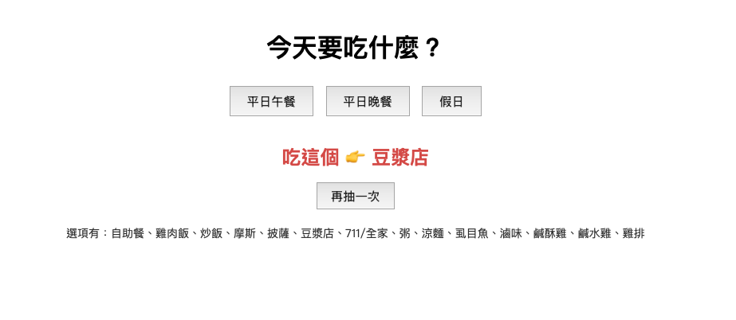

# 🥢 食物抽籤器 (Food Lottery Picker)

# 🥢 Food Lottery Picker

## 🚀 **Try it live:**  
## [🍱 Visit food-lottery.vercel.app 🍱](https://food-lottery.vercel.app)

A simple and fun web app to help you decide what to eat when you’re indecisive.

## 🔧 Features

- Three selectable time categories:
  - Weekday Lunch
  - Weekday Dinner
  - Weekend
- Each category has its own menu items
- Randomly pick one item per click
- Supports repeat draws with "Pick Again" button
- Displays full list of options under each category

## 🚀 How to Use

1. Open `index.html` in your browser.
2. Click one of the category buttons: Weekday Lunch / Dinner / Weekend.
3. Click the red button to randomly draw one food item.
4. You can click "Pick Again" as many times as you want.

## 🖼️ Screenshot

## 📁 Project Structure

📁 food-lottery/
├── index.html       # Main HTML file
├── screenshot.png   # Example UI screenshot
└── README.md        # This file

## 📝 Notes

- This version is desktop-optimized.
- You can extend it with mobile support, animations, or sound effects.

## 📜 License

MIT License
